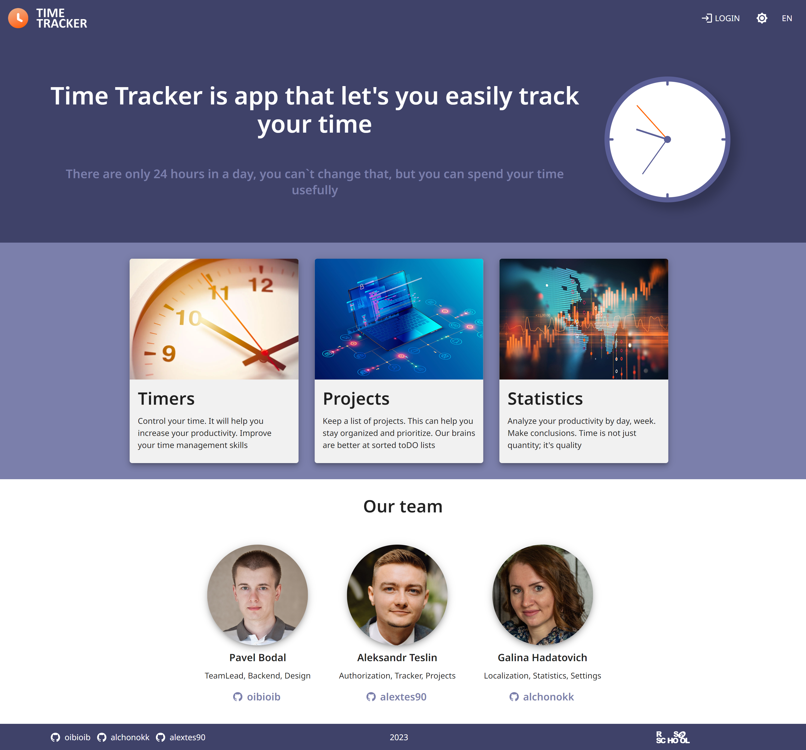
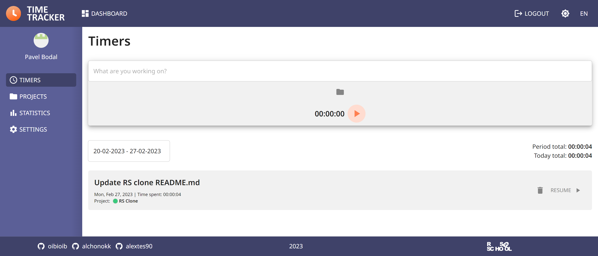
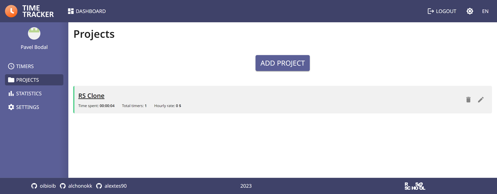
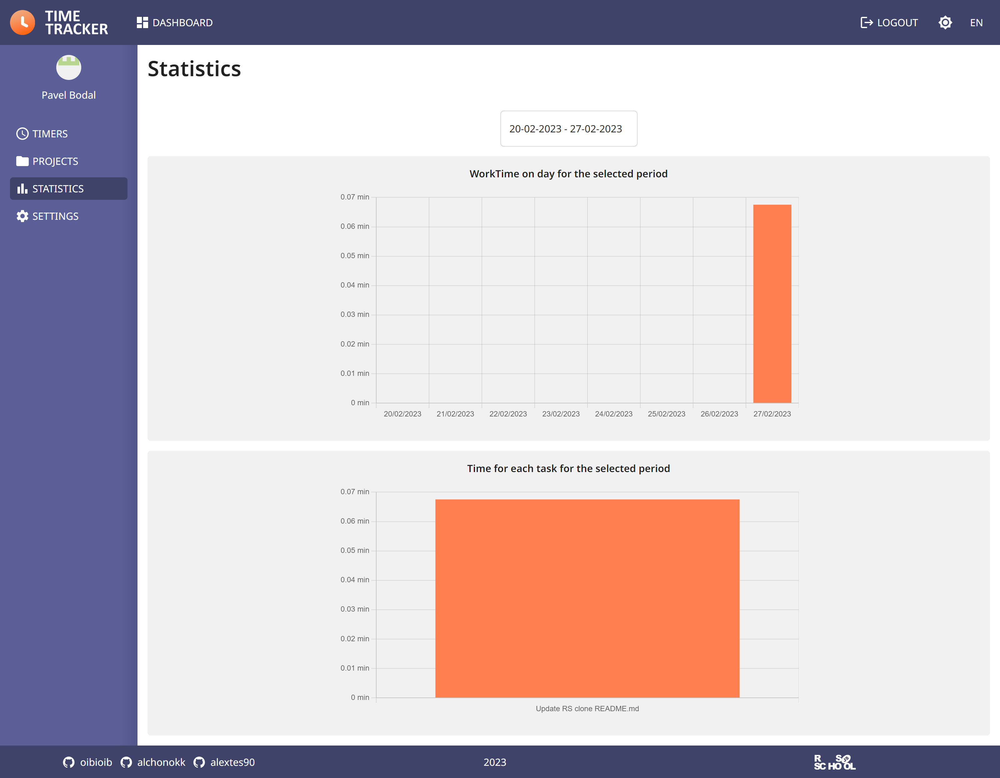

# RS clone - Time tracker

[RS School](https://rs.school/) final project, JS/FE Course 2022Q3

## Task 
https://github.com/rolling-scopes-school/tasks/blob/master/tasks/rsclone/rsclone.md

## Deploy 
https://jstots-team-rs-clone-2022q3.netlify.app/

## Used components and technologies:

- Typescript
- React
- React Router
- Redux Toolkit
- Chart.js
- MUI (React UI framework)
- CRA

## Backend
https://github.com/oibioib/time-tracker-backend/tree/develop

##  Screenshots

